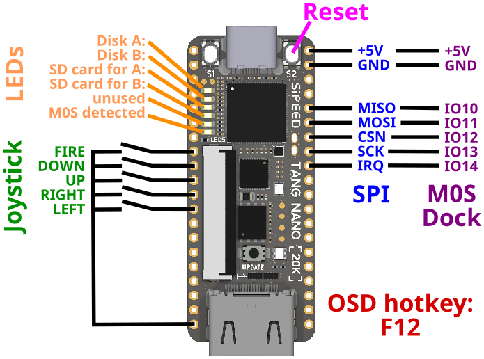
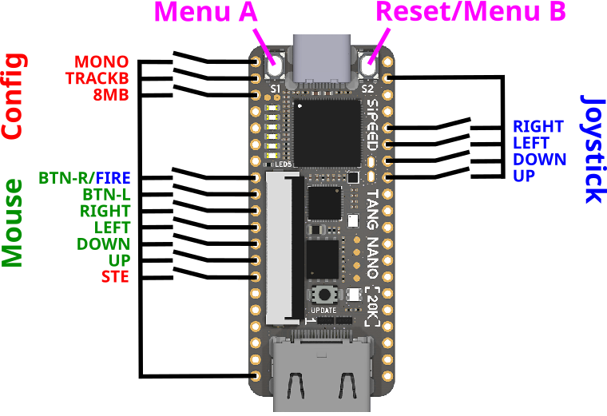

# Differences of previous versions

## IRQ in version 1.2.2

Since version 1.2.2 MiSTeryNano the [firmware for the M0S/BL616
MCU](firmware/misterynano_fw)
has an additional IRQ connection to the FPGA for faster
response times.



## SPI in version 1.2.0

Beginning with version 1.2.0 the connection between the M0S MCU and
the FPGA is a SPI bus. The wiring is the same as with the PS/2 variant
but the signals are used differently.


With the SPI bus the M0S was no longer limited to to keyboard and
mouse. Instead it also took over the SD card file system handling, the
control of the on-screen-display and various other tasks that are not
directly related to the retro machine itself.

## PS/2 and configuration in version 1.1.0

Version 1.1.0 implemented a PS/2 like connection to send the keyboard
and mouse data from the BL616 MCU into the FPGA.  All configuration
was done via connections on the board.


Since version 1.2.0 configuration is done via the OSD.

## Mouse/trackball up to version 1.0.1

The MiSTeryNano up to 1.0.1 implemented some basic mouse control via
five digital direction inputs on the Tang Nano 20k which needed to be
switched to GND.



Alternally a [Blackberry
Trackball](https://www.sparkfun.com/products/retired/13169) could be
used on the same pins. In this case the ```TRACKB``` config switch
needs to be closed.


The code is still in the main repository and can be activated in
[src/tangnano20k/top.sv](https://github.com/harbaum/MiSTeryNano/blob/main/src/tangnano20k/top.sv).

Since 1.1.0 mouse and keyboard are connected via USB and a seperate
MCU.