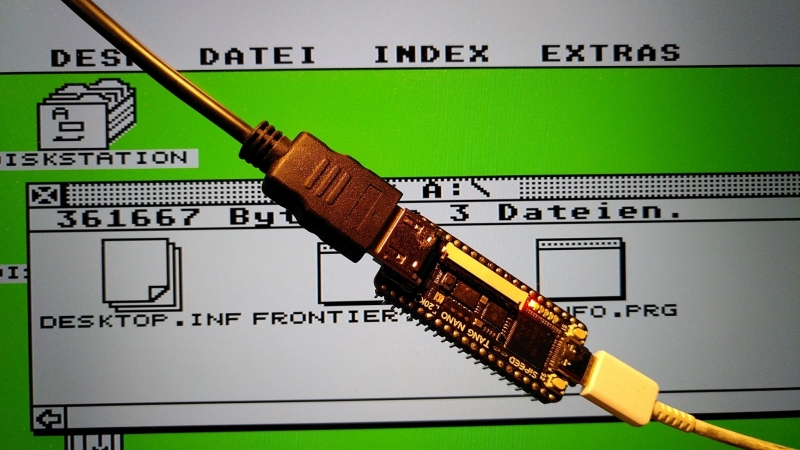

# MiSTeryNano

The MiSTeryNano is a port of the
[MiSTery Atari STE FPGA core](https://github.com/gyurco/MiSTery) to the
[Tang Nano 20k FPGA board](https://wiki.sipeed.com/nano20k). It has
also been ported to the [Tang Primer 25K](TANG_PRIMER_25K.md) and the [Tang Mega 138K](TANG_MEGA_138K.md).

For support and more information please visit the [Atari forum](https://www.atari-forum.com/viewtopic.php?p=457209).

## Current state

The MiSTeryNano is a work in progress. Current features are:

  * Atari ST/STE
    * Complete Atari ST/E chipset
    * ST or STE configurable
    * Cycle exact 8 MHz 68000 CPU
    * 4MB RAM, optional 8MB STRAM
    * color and monochrome video via HDMI
    * YM2149 and STE DMA sound via HDMI
    * Blitter
  * Supports most TOS versions
  * Full IKBD implementation
    * Mapped to USB via BL616 MCU
    * Mouse and keyboard via USB
    * Joystick via USB or dedicated IO pins of Tang Nano 20k
  * Floppy disk images
    * Read and write support for drive A: and drive B:
    * Images stored in .ST format on regular FAT/exFAT formatted SD card
  * ACSI harddisks
    * Read and write support for ACSI 0 and 1
    * Tested with AHDI, PP's driver and HDDriver 12.03
    * Images stored in .HD format
  * MIDI
    * Physical MIDI-IN and OUT
  * [Optional custom carrier board](board/misteryshield20k/)
  * [Optional case](https://github.com/prcoder-1/MiSTeryNano-Case)
  * Runs on various Tang variants
    * [Tang Nano 20k](https://wiki.sipeed.com/nano20k)
    * [Tang Primer 25k](TANG_PRIMER_25K.md)
    * [Tang Mega 138k](TANG_MEGA_138K.md)

## Videos

These videos primarily document the progress during development:

  * [MiSTeryNano #1: Is the Tang Nano 20k the cheapest and smallest Atari ST?](https://www.youtube.com/shorts/qndojsbH9jw)
  * [MiSTeryNano #2: Booting TOS 1.04 for the first time](https://www.youtube.com/shorts/yLxXRR_04UE)
  * [MiSTeryNano #3: We got a rainbow!](https://www.youtube.com/shorts/9wFxQvKtOY8)
  * [MiSTeryNano #4: Drives and Blitter](https://www.youtube.com/shorts/FfL01D0Zg0o)
  * [MiSTeryNano #5: Playing Atari ST Frontier](https://www.youtube.com/shorts/xJHF-LlaHFo)
  * [MiSTeryNano #6: B.I.G. DEMO](https://www.youtube.com/shorts/EXPfdhlpuFI)
  * [MiSTeryNano #7: Tang Nano 20k running Atari ST Oxyd2](https://www.youtube.com/shorts/Ud1P1vE5j84)
  * [MiSTeryNano #8: Atari ST with USB keyboard and touchpad](https://www.youtube.com/shorts/jjps1x1NjhE)
  * [MiSTeryNano #9: Tang Nano 20k as USB host](https://www.youtube.com/shorts/bP5gK3nmv-o)
  * [MiSTeryNano #10: New OSD for the FPGA Atari ST](https://www.youtube.com/shorts/zsHYcolqtpc)
  * [MiSTeryNano #11: Advanced SD card for FPGA Atari ST](https://www.youtube.com/shorts/NP1EnRj4Fk0)
  * [MiSTeryNano #12: Atari ST first boot from virtual hard disk](https://www.youtube.com/shorts/UPiLkYA_o0o)
  * [MiSTeryNano #13: Atari ST in Tang Nano 20k FPGA running Cubase 3 from Harddisk image](https://youtube.com/shorts/o6ABtje7zZ8)
  * [MiSTeryNano #14: Cubase MIDI audio replay with Atari ST FPGA and SAM2695](https://youtube.com/shorts/w8RZCzeMpiw)
  * [MiSTeryNano #15: Power Without the Price: The Tang Nano 20k is the cheapest Atari ST](https://youtube.com/shorts/-kPpSlpkzvA)
  * [MiSTeryNano #16: Atari ST MIDI Space Quest 3 on Roland MT32](https://youtube.com/shorts/IOfeoJvnrmE)
  * [MiSTeryNano #17: C64 on Tang Nano 20K](https://youtube.com/shorts/qh_TCCgo1xY)
  * [MiSTeryNano #18: Cheap RGB LCD for Atari ST in FPGA](https://youtube.com/shorts/_D7Gc8IL2GA)
  * [MiSTeryNano #19: Atari STE Stardust on Tang Mega 138K FPGA](https://youtube.com/shorts/CI1L_LBodlw)
  * [MiSTeryNano #20: Atari STE on Tang Primer 25k FPGA](https://www.youtube.com/shorts/i-hUT1_UNOY)

## Getting started

In order to use the MiSTeryNano the following things are needed:

  * [Tang Nano 20k FPGA board](https://wiki.sipeed.com/nano20k) to run the MiSTeryNano core
  * [M0S Dock](https://wiki.sipeed.com/hardware/en/maixzero/m0s/m0s.html) to connect USB keyboard and mouse
  * a breadboard to wire everything up and some jumper wires, or
  * [a MiSTeryShield](board/misteryshield20k/)
  * a USB-C to USB-A adapter to connect regular USB devices to the M0S Dock

## Installation

The installation of MiSTeryNano on the Tang Nano 20k using can be done
using a [Linux PC](INSTALLATION_LINUX.md) or a
[Windows PC](INSTALLATION_WINDOWS.md).

See the [trouble shooting guide](TROUBLESHOOTING.md) if you run into problems.

## Wiring

The properly flashed Tang Nano 20K will boot into the Atari ST desktop
even without anything else connected. But in order to use the system
you need at least a keyboard and most likely also a mouse. These are
usually connected through the M0S Dock.

Additional connections exist for a physical DB9 joystick or
Atari ST mouse and MIDI IN and OUT. The usage of these pins
is optional. They can just be left unconnected. A joystick may
then be connected via USB instead.

## Usage

The MiSTeryNano is mainly controlled through an on-screen-display (OSD)
overlaying the main Atari ST screen. The OSD is opened using the F12
key. It can then be used to select floppy and harddisk images and to
configure the running system.

