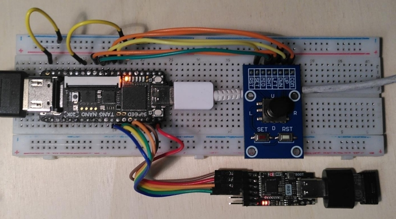
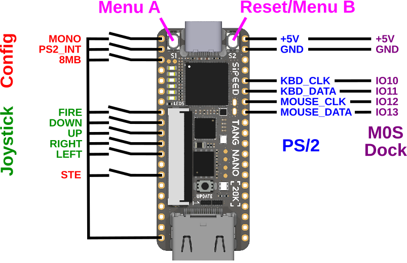

# MiSTeryNano

The MiSTeryNano is a port of the
[MiSTery Atari STE FPGA core](https://github.com/gyurco/MiSTery) to the
[Tang Nano 20k FPGA board](https://wiki.sipeed.com/nano20k).


## Current state

The MiSTeryNano is a work in progress. Current features are:

  * Atari ST/STE
    * Complete Atari ST/E chipset
    * ST or STE configurable
    * Cycle exact 8 MHz 68000 CPU
    * 4MB RAM, optional 8MB STRAM
    * color and monochrome video via HDMI
    * YM2149 and STE DMA sound via HDMI
    * Blitter
  * Supports most TOS
    * Tested with german TOS 1.04, german TOS 2.06 and US TOS 1.00
  * Full IKBD implementation
    * Mapped to USB via BL616 MCU
    * Mouse and keyboard via USB
    * Joystick via IO pins of Tang Nano
  * Floppy disk image stored on regular FAT formatted SD card
    * Tested with several 4, 16 an d 32 GB cards
    * Up to 32 .ST disk images selectable via on-screen-display

## Missing features

  * Support for floppy drive B
  * Support for hard disk images
  * Floppy disk write support

Currently the FPGA on the Tang Nano 20k is around 87% full and this setup
is considered to be mostly complete with respect to the FPGA itself.
Further development will focus on the BL616 microcontroller of the Tang
Nano 20k which will allow to implement the missing features.

## Getting started

In order to use the MiSTeryNano the following things are needed:

  * [Tang Nano 20k FPGA board](https://wiki.sipeed.com/nano20k) to run the MiSTeryNano core
  * [M0S Dock](https://wiki.sipeed.com/hardware/en/maixzero/m0s/m0s.html) to connect USB keyboard and mouse
  * a breadboard to wire everything up
  * some jumper wires
  * a USB-C to USB-A adapter to connect regular USB devices to the M0S Dock



MiSTeryNano has been developed and tested under Linux. Thus the following
explanations expect a Linux system to be used. The installation consists
of four steps:

### Step 1: Installation of the core

Use [openFPGAloader](https://github.com/trabucayre/openFPGALoader) to install the MiSTeryNano core named [```atarist.fs```](https://github.com/harbaum/MiSTeryNano/releases) on your Tang Nano 20k:

```
$ openFPGALoader -f impl/pnr/atarist.fs 
write to flash
Jtag frequency : requested 6.00MHz   -> real 6.00MHz  
Parse file Parse ../atarist/impl/pnr/atarist.fs: 
Done
DONE
Jtag frequency : requested 2.50MHz   -> real 2.00MHz  
Jtag frequency : requested 10.00MHz  -> real 6.00MHz  
erase SRAM Done
Detected: Winbond W25Q64 128 sectors size: 64Mb
Detected: Winbond W25Q64 128 sectors size: 64Mb
RDSR : 00
WIP  : 0
WEL  : 0
BP   : 0
TB   : 0
SRWD : 0
00000000 00000000 00000000 00
Erasing: [==================================================] 100.00%
Done
Writing: [==================================================] 100.00%
Done
```

### Step 2: Installation of the TOS image(s)

Most TOS images should be supported by now. This has been tested with
US TOS 1.00 (60 Hz NTSC video) and german TOS 1.04 and TOS 2.06 (both
50 Hz PAL video).

This needs to be flashed into the flash ROM of the Tang Nano 20k at
1MB offset:

```
$ openFPGALoader --external-flash -o 1048576 tos162de.img
write to flash
Jtag frequency : requested 6.00MHz   -> real 6.00MHz  
Parse file DONE
Jtag frequency : requested 2.50MHz   -> real 2.00MHz  
Jtag frequency : requested 10.00MHz  -> real 6.00MHz  
erase SRAM Done
Detected: Winbond W25Q64 128 sectors size: 64Mb
Detected: Winbond W25Q64 128 sectors size: 64Mb
RDSR : 00
WIP  : 0
WEL  : 0
BP   : 0
TB   : 0
SRWD : 0
00100000 00000000 00000000 00
Erasing: [==================================================] 100.00%
Done
Writing: [==================================================] 100.00%
Done
```

Now the MiSTeryNano should already boot into the TOS desktop in ST mode.

For STE mode a STE capable TOS needs to be flashed to a different flash
location:

```
$ openFPGALoader --external-flash -o 1310720 tos206de.img
```

This TOS image is always use when STE mode is selected (see the
configuration section below)

### Step 3: Installation of the HID USB firmware

Keyboard and mouse are connected via USB and a [M0S Dock](https://wiki.sipeed.com/hardware/en/maixzero/m0s/m0s.html). This needs to be equipped with
a matching [HID USB firmware](bl616).

At this point mouse and keyboard should be working.

### Step 4: Installation of a floppy disk image

Since releae 0.9.0 MiSTeryNano supports reading floppy disk images from
a FAT formatted SD card. This has only been tested with 16 and 32 GB cards.
Especially smaller cards may not work if the FAT file system uses less
then 8 sectors per cluster.

At least a file named [```DISK_A.ST```](sim/floppy_tb/disk_a.st) needs to be placed in the root
directory of the SD card. This file is by default used as a disk image
for floppy drive A. Further .ST disk images can be placed in the root
directory of the SD card. Up to 32 disk images can be handled by the
core at the moment.

The SD card is to be inserted into the slot on the bottom side of the
Tang Nano 20k inconveniently placed right below the USB connector.
The MiSTeryNano will automatically load a file named [```DISK_A.ST```](sim/floppy_tb/disk_a.st) and use it as the image for floppy disk drive A.

#### Changing the floppy disk image

You can use the buttons on the left and right of the USB-C connector
on the Tang Nano to change disk images. Button S1 will open the
on screen display. Short presses on S1 will step through the installed
images. Pressing S2 will insert the current image into floppy drive A.
A long press on S1 will close the on screen display without changing the
installed disk images.

Button S2 will also act as a reset button for the Atari ST when the
on screen display is not open.

### Configuration

Since version 1.1.0 MiSTeryNano uses a [BL616
controller](https://github.com/harbaum/MiSTeryNano/tree/main/bl616)
for mouse and keyboard connectivity. This BL616 can either be an
externally connected M0S Dock or the internal BL616 of the Tang Nano
20k. In the this case the ```PS2_INT``` configuration 
has to be selected.

A digital DB9 joystick can be attached directly to the board.



