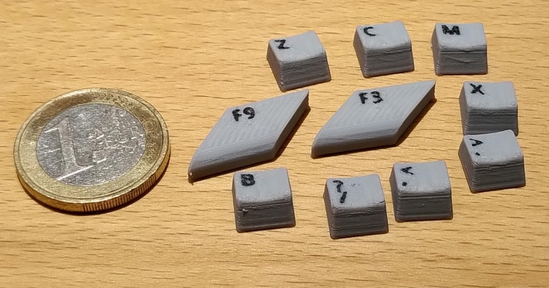

# MiSTeryNano - Mini ST keyboard

This is a work in progress. It's meant to become a half size keyboard
inspired by the Atari ST series. It's meant to become the basis
of some kind of Mini Atari ST based on the MiSTeryNano FPGA.

They keyboard is primarily designed to be a fully functional design
suited for simple use cases like renaming a file or selecting game
options. It's not meant to be usable to write texts or for any other
productive use case.

## Hardware

The [hardware](pcb) consists of cheap 7x7mm 6 pin momentary switches. These
switches are arranged in the same 15*8 matrix used inside the original
Atari ST keyboard.

The matrix is addressed via serial shift registers requiring four pins
on the controlling device. Two 8-bit serial to parallel shift
registers are used to drive the 15 columnns and a single serial to
parallel shift register is being used to read the eight rows. For
further info on reading the matrix via the serial interface refer
to the [kbd_test Arduino test sketch](kbd_test). The 16th output of
the serial shift registers drive a user conrollable LED in the top right
corner similarily placed to the floppy LED on a Atari STF. This might e.g.
be used in an emulation environment to indicate disk/sd card activity.

The keyboard can either be driven by 3.3V or by 5V and is thus compatible
with nearly all microcontrollers as well as many consumer FPGAs.

## Arduino sketches

The MiSTeryNano keyboard comes with two Arduino sketches. The
[kbd_test](kbd_test) sketch can be installed onto any regular Arduino
Uno, Nano or the Micro and permanently scans the keyboard for pressed
keys and reports the in plain text on the serial monitor. The sketch
also permanently flashes the user led in the top left corner of the
keyboard.  The [arduino_hid](arduino_hid) sketch is meant to be used
in a Sparkfun Pro Micro or Arduino Micro and presents the MiSTeryNano
keyboard as a regular USB keyboard to e.g. a PC or Raspberry Pi. This
sketch uses the user LED to indicate the Caps Lock state and emits F12
for the international key. The later is useful for the US keycaps as
the international key (right of the left shift key) is not present on
US keyboards and can this way be used to open the on-screen-display
or an emulator menu.

## Keycaps

The keycaps have been designed to be printable on a Bambulab Carbon X1
using a 0.4mm nozzle, 0.8mm layer height and two colors of PETG filament.

The keycaps are being designed in FreeCAD using a small macro script
to derive the various variants from a small set of designs. This also
exports [STL files](stl) for printing as well as [WRL files](wrl) for
rendering in kicad.

The image at the top shows they keyboard with US keycaps as currently
designed. The PCB supports the international key right to the left
shift key as well. In the US variant it's covered by the bigger keycap
of the left shift key.

