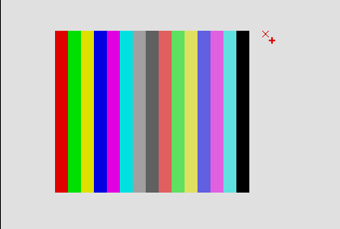

# MiSTeryNano Simulations

When used under Linux the ```Gowin Analyzer Oscilloscope (GAO)``` cannot
be used due to incompatibilities between the GoWin Programmer software and
the programmer hardware of the Tang Nano 20k.

To cope with this, most development of the MiSTeryNano was done using
a [Verilator](https://www.veripool.org/verilator/) simulation. At least
version 5.015 is needed for these simulations.

The simulations all work similar. E.g. a ```make wave``` will
compile and run the simulation and will show the resulting
waveforms in gtkview.

## atari_tb

[Atari_tb](atari_tb) simulates the complete Atari ST incl. video,
floppy and ACSI harddisk. The simulated Atari runs at about 1% real
speed depending on the speed of your PC. This allows for extensive
debugging of the Atari ST core and can even be used to boot games
and demos.

## floppy_tb

[Floppy_tb](floppy_tb) simulates the connection between the verilog
implementation of the fdc1772 floppy disk controller and the [Verilog
SD card reader](https://github.com/WangXuan95/FPGA-SDcard-Reader). It reads
a sector from the simulated SD card and emits it via the floppy disk
controller implementation.

The latest version of the floppy testbench includes testing of the
FAT parser for SD card. It thus expects a SD card image named ```sd16g.img``` with one partition which in turn has the ```disk_a.st``` file stored
in the root directory. One way to create such an image is to copy
```disk_a.st``` onto an SD card (only 16GB cards have been tested so far)
and then copying the raw card image into a file. The first 10MB of the
card are probably sufficient:

```
$ dd if=/dev/sdb of=sd16g.img bs=1024 count=10240
```

## sdc_tb

The [SD card testbench](sdc_tb) is a low level testbench that was
created to implement a 4 bit SD card driver with read and write
capabilities. It is based in the
[FPGA-SDcard-Reader](https://github.com/WangXuan95/FPGA-SDcard-Reader)
project. This testbench includes a verilator/c++ implementation of an
SD card.

This testbench comes with an [Arduino sketch](sdc_tb/sdtest) that was
used on a ESP8266 to test and learn about the 4 bit SD card mode with
a real SD card connected to the ESP8266 microcontroller.

## flash_tb

[Flash_tb](flash_tb) simulates interfacing to the SPI flash of the Tang Nano
20k. This test runs in simulation as well as on the real device. A test
pattern can be stored in flash and is then sent to the on-board LEDs
for visual inspection.

## ram_tb

[Ram_tb](ram_tb) simulates ram and rom interfacing to the CPU and the
GSTMCU chipset. It comes with some [test code](ram_tb/ram_test.s)
which on the real device [displays some test
pattern](https://www.youtube.com/shorts/qndojsbH9jw). A stable test
image means that RAM and ROM are both working reliably.



The same test also runs in verilator and exports the test image from
the testbench. It can be viewed by ```make video```.

## video_tb

[Video_tb](video_tb) is a test for the video generation. It displays
a static image and runs it through the ```scandoubler.v``` and
```video_analyzer.v```. This demo will also write an image file
for visual inspection.

The demo can also be run on real hardware. In that case the image
has to be copied to flash memory first:

```
$ openFPGALoader --external-flash -o 2097152 vmem32k.bin
```

If you want to test a monochrome video use ```mono32k.bin``` for
a monochrome test image.
