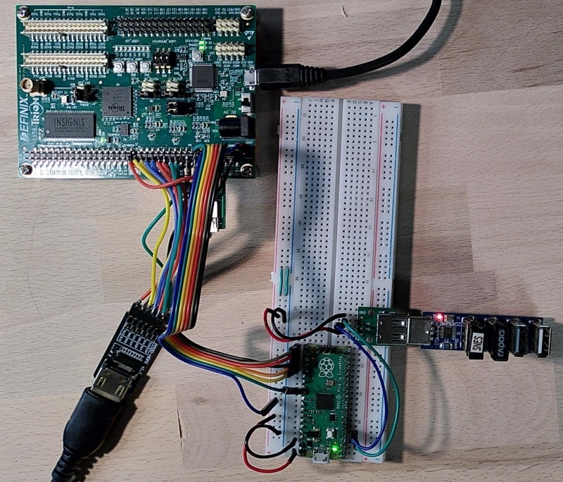

# MiSTeryNix, MiSTeryNano for Efinix T20

This is a very early port of MiSTeryNano to the Efinix T20BGA256
development board, allowing it to run [Atari ST](https://de.wikipedia.org/wiki/Atari_ST) software like the
game [Spherical](https://www.atarilegend.com/games/spherical).


## Additional Hardware

The setup requires some additional hardware to be connected to the ```BANK1B_1C```
connector. The photo below shows the HDMI being connected using an iCESugar
HDMI PMOD. The SD card is barely visible under the colored ribbon cable 
and a Raspberry Pi Pico is set up on a breadboard as the FPGA companion.
It uses an additional USB connection with a USB hub to control wireless
USB receivers for keyboard, touchpad and game pad.



An HDMI connector using 100nF capacitors in series with each TMDS line.
Some screens also need 5V to be supplied. It's thus preferred to use a generic
HDMI PMOD that generates all necessary signals from its 3.3V and data connections.

| Signal  | Pin  |
|---|---|
| TMDS_CLOCK_P  | GPIOL_11 |
| TMDS_CLOCK_N  | GPIOL_12 |
| TMDS_DATA_0_P | GPIOL_13 |
| TMDS_DATA_0_N | GPIOL_14 |
| TMDS_DATA_1_P | GPIOL_15 |
| TMDS_DATA_1_N | GPIOL_16 |
| TMDS_DATA_2_P | GPIOL_17 |
| TMDS_DATA_2_N | GPIOL_18 |

A SD/TF card slot needs to be connected to using six 33 ohms series resistors
for the data, command and clock lines.

| Signal  | Pin  |
|---|---|
| SD_DAT[0] | GPIOL_22 |
| SD_DAT[1] | GPIOL_21 |
| SD_DAT[2] | GPIOL_26 |
| SD_DAT[3] | GPIOL_25 |
| SD_CMD | GPIOL_24 |
| SD_CLK | GPIOL_23 |

And finally, an [FPGA Companion](https://github.com/harbaum/FPGA-Companion/) is needed for USB and general system control via SPI.

| Signal  | Pin  |
|---|---|
| SPI_CLK | GPIOL_29 |
| SPI_MOSI | GPIOL_30 |
| SPI_MISO | GPIOL_27 |
| SPI_CS | GPIOL_28 |
| SD_INT | GPIOL_31 |

## Limitations

The T20 is used to 95% by this and a few limitations had to be implemented to achieve this.

  - The Atari ST Blitter is permanently disabled
  - The Atari STE extensions are permanently disabled
  - ACSI hard disk support is permanently disabled
  - Builds are unstable, and you might need to play with the ```seed``` value to get a stable result
  - HDMI is generated by pure logic and without dedicated LVDS shifters or the like and the signal may not be accepted by all displays
  - Currently, SD card writing does not work. Neither settings can thus be saved from the OSD menu, nor can the Atari ST write to floppy disk. This may eventually be fixed.

## Flashing the operating system

The TOS operating system is executed from the 4MB SPI flash. The TOS operating system needs to be flashed to offset 1MB (0x100000 or 1048576) into the flash
using either the Efinity programmer or openFPGAloader. The following command will flash the German TOS 1.04 operating system.

```
$ openFPGALoader -b trion_t20_bga256 --external-flash -o 0x100000 ./tos104de.img
```

An optional secondary TOS version might be flashed to offset 0x140000 to be selectable from the on-screen-display. 
